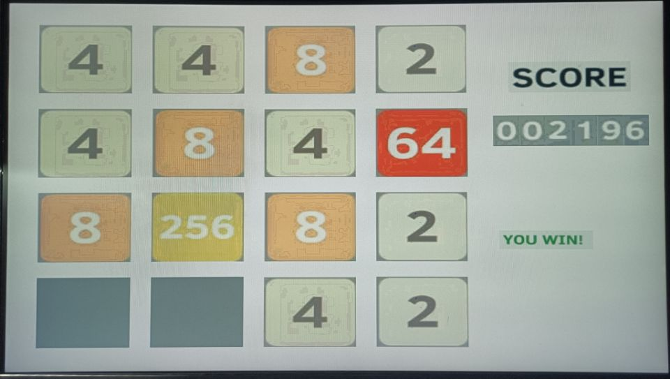
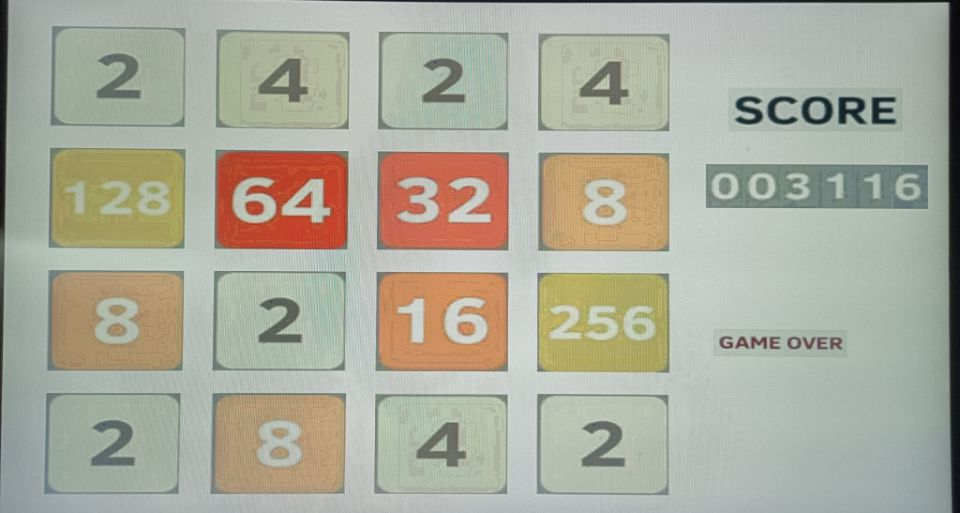
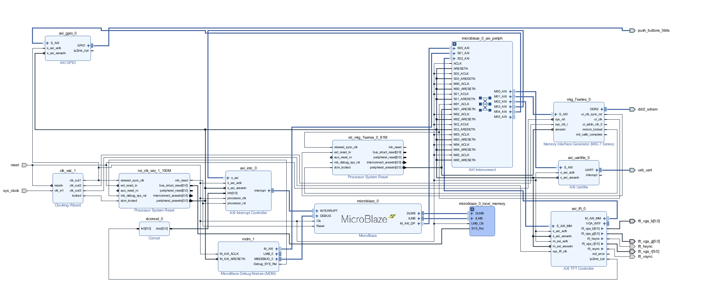
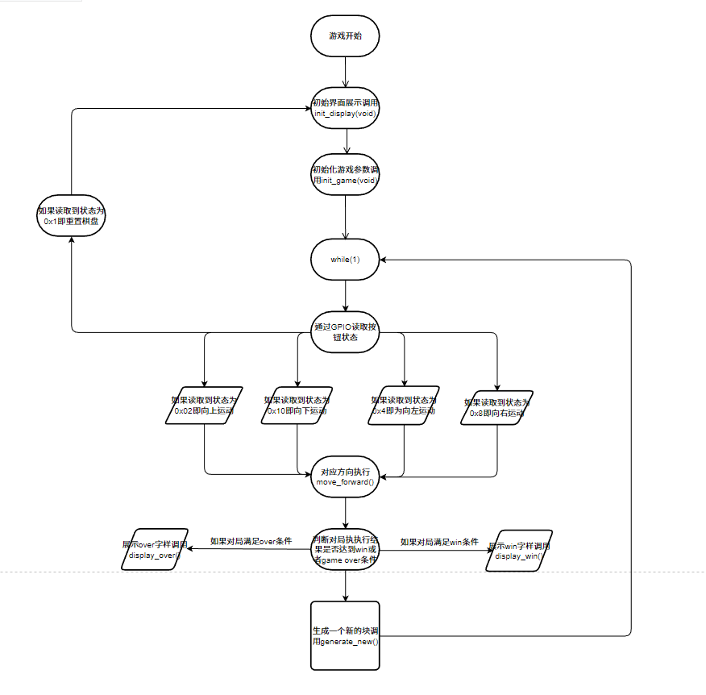

## README

**项目名称：** 2048游戏

**项目环境：** vivado 2018.3 + SDK + NEXYS4 DDR开发板

**具体文件夹说明**：

- `./2048_Final`包含了全部的代码文件
- `./image2LCD`包含了所需要的图像转换软件
- `./images`包含了需要转换的图像
- `./VGA.zip`是一个基本的VGA硬件平台（如果确实搭不出来可直接在上面开发）

**实验结果展示：**

**实验框图展示:**

**Hints:** 此文件夹包括了微机原理综合项目实现的近乎所有代码和依赖文件，代码部分全部为个人手写实现，实际开发时间仅为一天，无法照顾到所有细节，如果有任何问题，欢迎issue。

