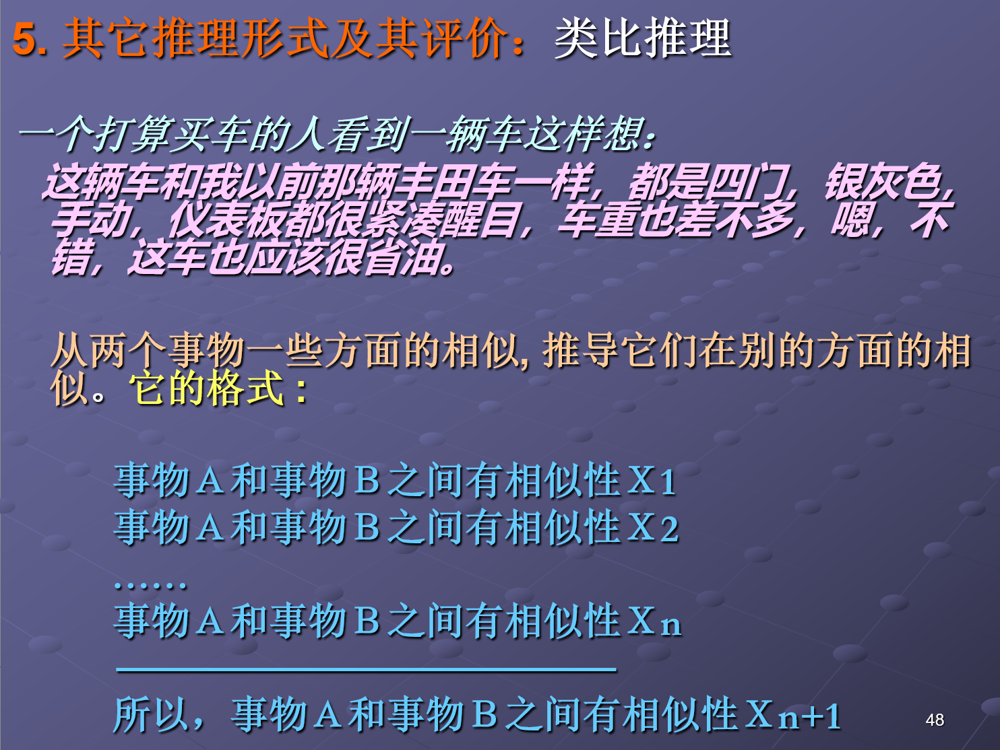
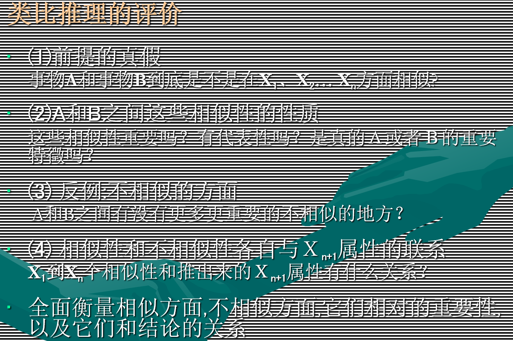
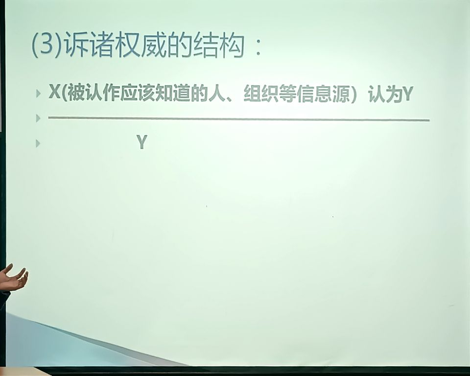
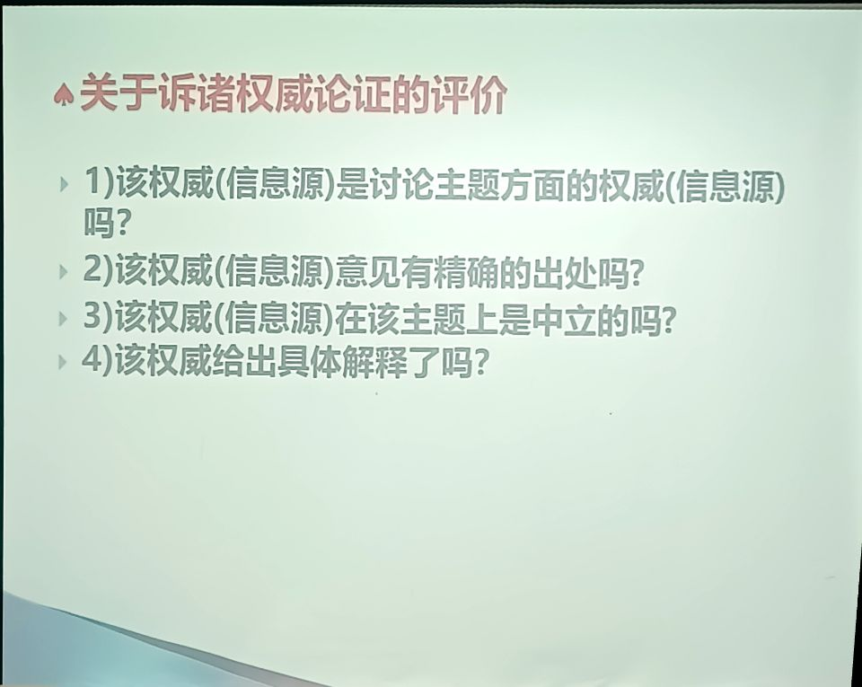

## 推理及其评价

### 六种论证出错的方式

- **无关谬误**：诉诸情感、传统、权威、威胁、人身攻击、无知，无关谬误有时候是灾难性的。

- **不具体、不细致**：用一种原因或原则来囊括一切

- **理由不充分，不重要，不全面** 

- **推理无效**：从原话中推出一个荒谬的结论，从而证明原话是错的。

- **类比无效** ：将他人的成功或失败经验或者做法完全复制在自己的环境中，缺乏具体问题具体分析的原则 

- **引用权威不适合** 

  - 引用权威来论证的情况包括：

      （１）使用权威的词句、言论、观点、证明来为自己现在的立场论证；

      （２）使用已有的、其他情况下的理论来论证和指导现在的、新的实践；

      （３）类比以前或其他地方的成功实例来论证它对现在的,新的情况的应用。

  - １）引用不忠实原意， 也就是断章取意或歪曲的引用。这样的引用不再具有权威性。

    ２）引用的理论不适合现在讨论的问题，引用的例证和观点本身是忠实原意的，但和现在要说明的现象的关系却成问题。

### 推理的类型和有效性

- 归纳推理：由一个个的例子来推导出普遍的结论。 **好的归纳是高概率的推理**
- 演绎推理：从一般向个别的推理 
  - 三段论：大前提，小前提和结论 
  - 演绎逻辑中推理的“充足性”: 前提“必然地”导致结论。 

- 推理的可靠性和充足性与结论的内容大小成反比关系 
- 不同类型的推理对充足性有不同的要求 ：从一般向个别的推理  

#### 演绎推理的有效性

- **前提为真必然保证结论为真**
- **有效的推理保真不保假**
- 前提为真，结论一定为真
- 前提为假，结论不一定为假，而是可真可假

#### 五种有效的演绎推理形式

- 肯定前件的推理：`P -> Q and P then  Q`
- 否定后见的推理：`P -> Q and ~Q then ~P`
- 选言推理：`P or Q and ~P then Q`
- 假言推理：`P -> Q and Q -> R then p -> R`
- 三段式： `all is a ,while b is in a then b is a  `

#### 归纳统计推理及其评价

- 归纳推理的或然性: **高概率和内容的增长** 
- 高概率和内容的反比关系 
- 评价
  - 前提可靠的标准
  - 前提对结论的**充足支持**的标准
    - 充足支持的标准首先是**相关性**
    - 充足支持在于证据的**数量,种类,质量**,和结论的**强度。** 
    - 调整结论的**范围**和**强度**可以增加归纳推理的**恰当性** 
- 统计归纳是在一定数量的例子中发现有若干百分比的Ａ有属性Ｂ，然后归纳为在所有的Ａ中有同样百分比的Ａ有属性Ｂ。它的格式是： 

- 统计推理的评价
  - 样本的大小
  - 样本的代表性
  - 调查方式

#### 类比论证

#### 诉诸权威

#### 因果论证

