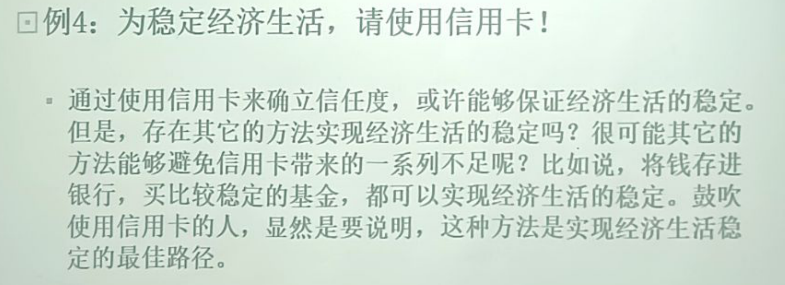
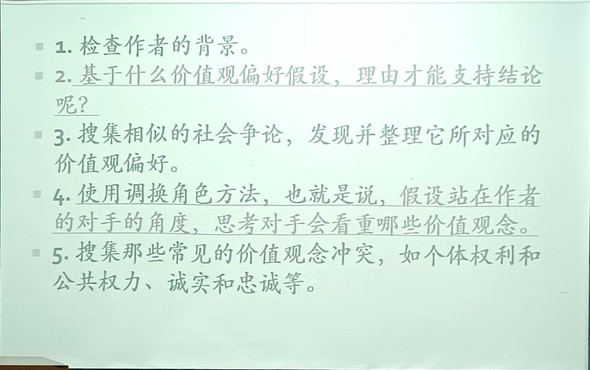
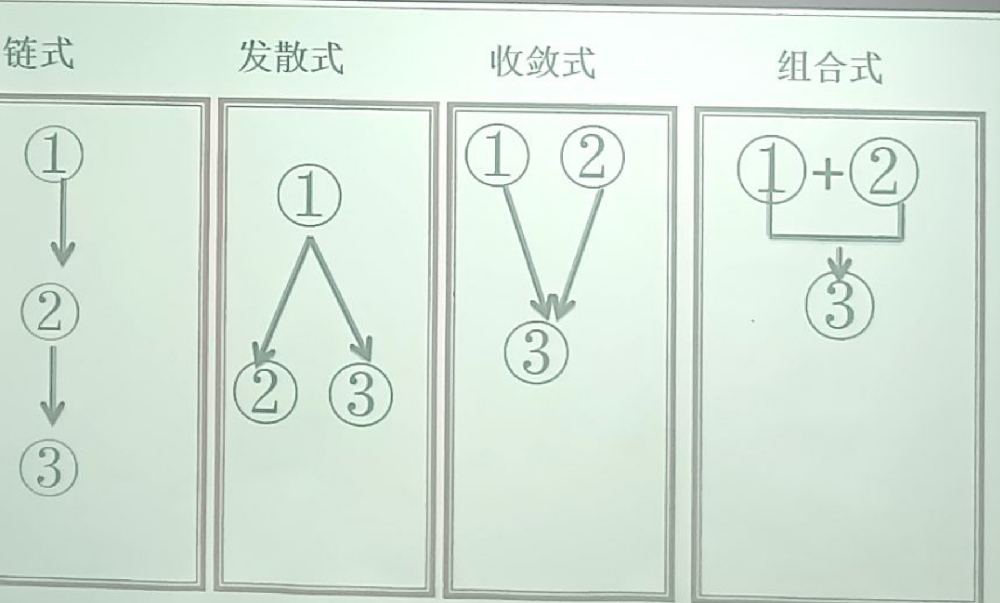
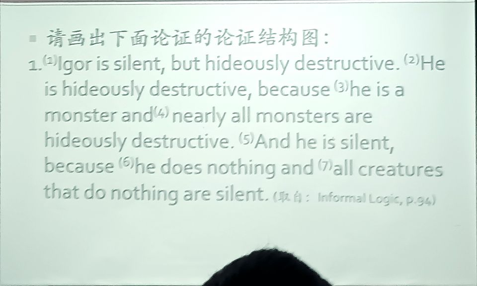
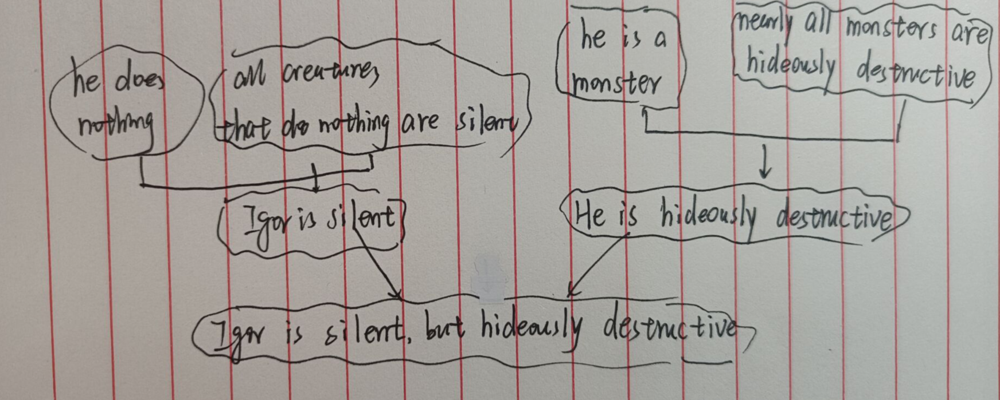

## 论证结构

#### 什么是议题

议题就是争论的问题，论证的目标就是对这些问题做出回答，并且给出合理性分析

- **规范性议题**： 关于我们应该做什么，必须做什么，允许做什么，什么是对，什么是错等的规范性问题，“应该”、“必须”、“允许”、“对”、“错”、等词汇被称作”规范性词汇“。（纵使我们有”上帝之眼“，也不能仅仅凭借”看看“，就能回答牵涉到人类做出的规范富有争议性
- **描述性议题**：是关于我们世界过去怎样、现在怎样以及将来怎样的描述性问题。（如果我们有”上帝之眼“，看看这个世界便可以知道所有描述性问题的答案，不幸的是，我们没有。也因此，对于什么引起高血压这样的议题，我们只能给出相对合理的答案，而不是the case）

#### 如何寻找议题

- 看位置：议题常常出现在标题或论证的开头

#### 如何寻找描述性假设

1. **填空原则**：寻找前提和结论之间的”缺口“，无论对于寻找价值观假设还是描述性假设都是非常重要的线索（即”如果理由为真的话，其他哪些东西为真，结论将能获得更好的支持“）
2. **寻找支持理由的理由**：某些理由的合理性是依赖于认定为真的其他路由的
3. **同一角色方法**：从作者的角度看，即找到作者的背景或者职业，试图从他的角度来完成论证
4. **转换角色法**：从反方的观点来看，想想自己站在反方立场，问自己在什么情况下，作者的论证是没有说服力的

#### **规范性假设中主要是指隐含假设**：

- 价值观偏好假设
- 最佳途径假设
- 最佳解释假设

#### 最佳途径、最佳解释隐含假设

##### 最佳途径

最佳途径可以用到实践论证中，而实践论证的结论是我们应该做某个行为，而理由是该行为能实现某个理想目标，实践论正的常见结构如下：

- **(1) 我要达到目标p**
- **(2) 若我做行为A（或采取某个方案），则能实现P**
- **所以, (3) 我要去做A（采取这个方案）** 

但是当我们补充隐含假设后

- **(1) 我要达到目标p**
- **(2) 若我做行为A（或采取某个方案），则能实现P**
- **(3) 做行为A（或采取某个方案）是实现P的最佳选择**
- **所以, (4) 我要去做A（采取这个方案）** 

##### 最佳解释

最佳解释可以用到解释性论证中：

- **(1)相机无法开机**
- **(2) 如果相机电池没电了，那么，相机无法开机**
- **所以，(3)相机电池没电了**

但是当我们补充好最佳解释隐含假设中就有：

- **(1)相机无法开机**
- **(2) 如果相机电池没电了，那么，相机无法开机**
- **(3)或许相机坏了导致，或许操作不当导致的，但是，这两种都不太可能，因为刚刚还能用，而且我已经完了几年相机了**
- **所以，(4)相机电池没电了**

常见的解释论证结构是：

- (1) P 现象发生了
- (2) 如果X，则P现象就会发生
- 所以,(3) X

完善后的解释论证结构：

- (1) P 现象发生了
- (2) 如果X，则P现象就会发生
- **(3) 与其他可能解释相比，X能更好地解释现象P**
- 所以,(4) X

##### 价值观偏好假设

即关于一个社会论题，他表现为在两个价值观念中偏好一个，或者优先考虑一个，或者以其中一个为主

**如何寻找价值观偏好假设**

#### 常见的几种论证结构模式

#### 例题

