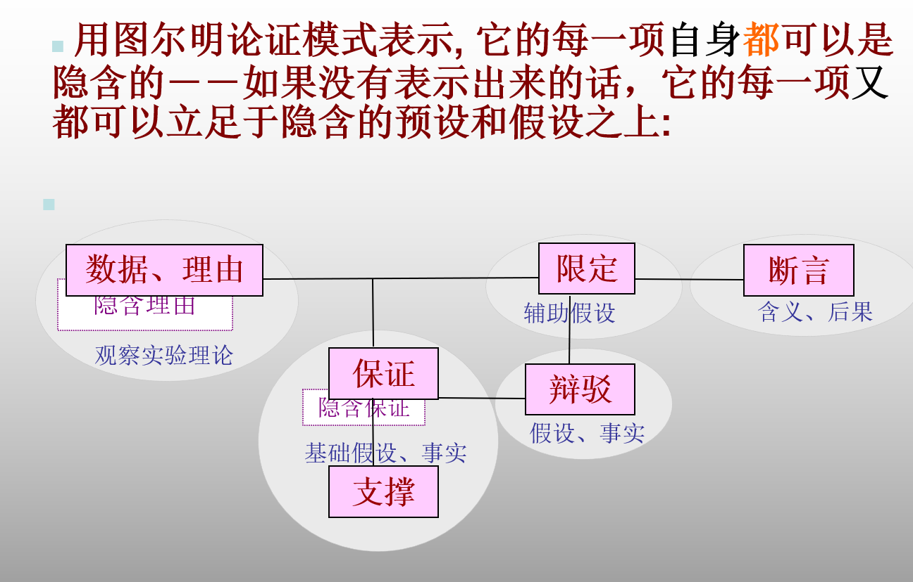

## 隐含假设

### 隐含假设类型

- 预设假定（presuppositions）或者叫“指称假定” 
- 隐含前提(supressed premises), 省略的前提：它们本是形成完整论证的必要部分,但在表述中被省略了, 所以又被称为“填空者”  
- 支撑假设(underlying assumptions), 又被称为“支撑者”,是下一个层次的隐含假设──前提的前提、前提后面没有表述出来的观念、知识和事实。 
- 含义（implications），它主要指论证进一步蕴涵的、不明显的观念和实际后果.

### 评价隐含假设的准则

- 忠实原则（是否忠实作者原意）+ 宽容原则（将原来的论证往合理有效的方向构建）

- 强弱合适

  - 强弱合适的问题很重要，太强便成为负担，起反作用。太弱不足以使论证有效，重申前提是最弱的，没有了内容

  - 逻辑上的强和弱的概念，是指适用的范围的大小，和确定性的高低 

- 不多余，增加的隐含假设不要等于原来已有的、已经表述出来的前提或者假设。 

- 可检验性和可信性：隐含假设也是论证的前提，所以需要是可检验证实的; 或者是可相信、可接受的。 

