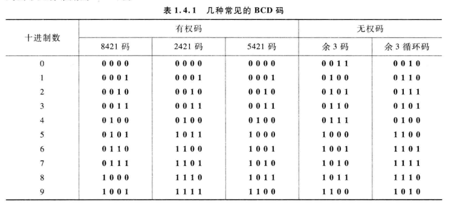
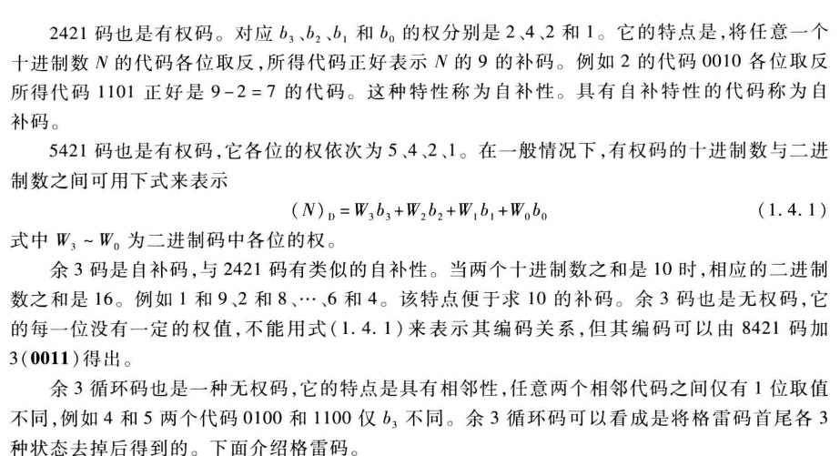
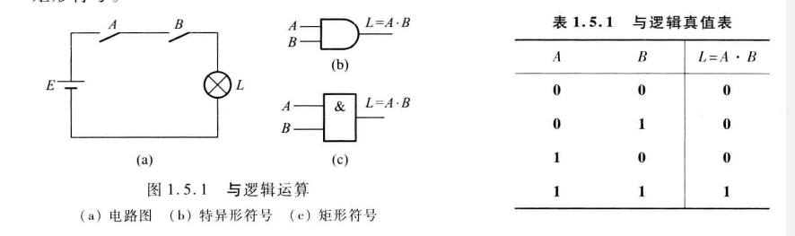
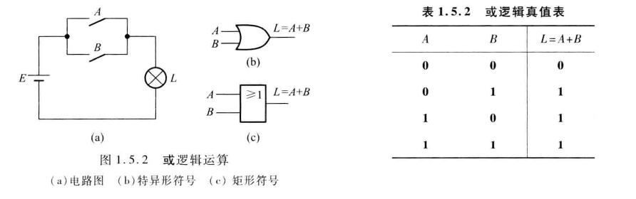
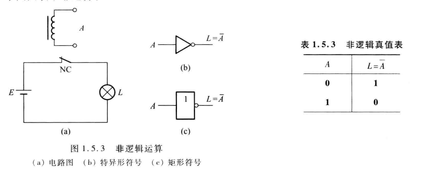
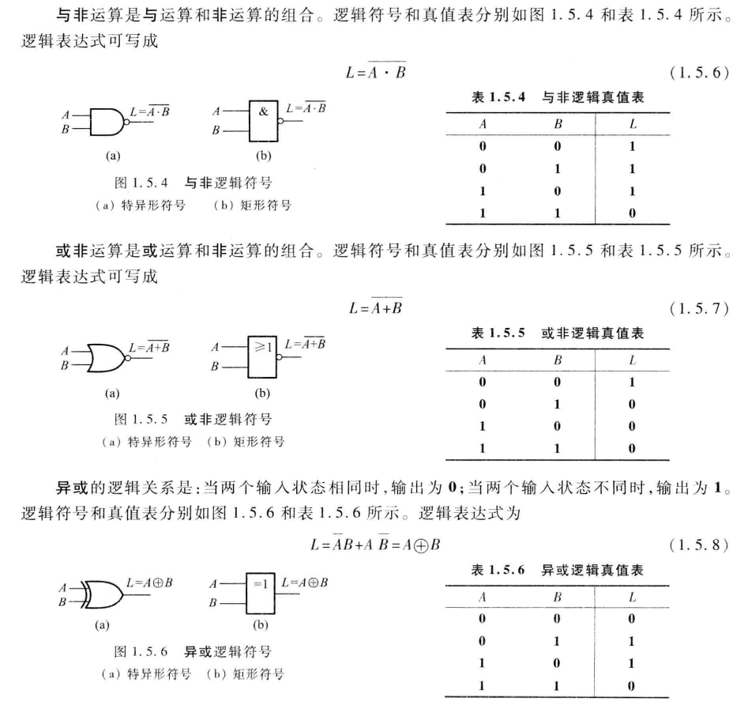

# 第一章 数字逻辑概论

## 数字信号与数字电路

### 数字集成电路的分类及特点

数字电路可以分成：

- 组合逻辑电路
- 时序逻辑电路

#### 数字集成电路的分类

衡量集成电路中有两个重要的参数：

- 集成度
- 特征尺寸

按照集成度分类：

- 小规模 （最多十二个）
- 中规模
- 大规模
- 超大规模
- 甚大规模

**逻辑门**是数字集成电路中的主要单元电路

#### 数字集成电路的特点

- 稳定性高，抗干扰能力强
- 易于设计
- 便于集成，成本低廉
- 可编程性
- 高速度，低功耗
- 便于储存、传输和处理

### 模拟信号和数字信号

- 模拟信号：连续变化的物理量
- 数字信号：与模拟量相对应的另一类物理量

#### 数字信号的描述方法

##### 二值数字逻辑和逻辑电平

用0和1来描述而观世界存在的彼此相互关联又相互对立的事物

- 当信号电压在3.5-5V之间，都表示**高电平**
- 当信号电压在0-1.5V范围内，都表示**低电平**

##### 数字波形

- 非归零型：在一个时间拍内用高电平表示1，低电平代表0
- 归零型：在一个时间拍内有脉冲表示1，无脉冲表示0
- 非归零型信号使用广泛，其每位数据占用一拍时间
- 每秒钟传输的数据的位数成为**数据率**或**比特率(bit rate)**
- 周期性数字波形常用周期 T 和频率 f 表示。矩形波型的脉冲宽度用$t_w$表示，表示脉冲作用时间
- **占空比**：$q=\frac{t_w}{T}*100\% $
- **上升时间**：设脉冲幅值为$V_m$ ，则将矩形脉冲从$10\%V_m$ 到 $90\%V_m$所需要的时间成为上升时间
- **下降时间**：上升时间对应的相反概念
- **脉冲宽度**$t_w$：脉冲上升沿的$50\%$ 到 下降沿的 $50\%$两个时间点所跨越的时间

## 数制

### 十进制

任意十进制表示：
$$
（N)_D = \sum_{i = -inf}^{inf} K_i * 10^i
$$
任意进制数表达式：
$$
（N)_R = \sum_{i = -inf}^{inf} K_i * R^i
$$
其中$R$是基数

### 二进制

#### 表示方法

$$
（N)_B = \sum_{i = -inf}^{inf} K_i * 2^i
$$

#### 二进制的优点

- 二进制的数字电路简单可靠，所用元件少
- 基本运算简单，运算操作方便

#### 二进制数据的传输

- 传输一位数需要一个时钟周期，并且在时钟脉冲的下降沿完成
- 如果要求传输速度块，可以考虑使用**并行传输**的方式，其也是一种常用的技术

### 十-二进制之间的转换

整数部分：

- 除二取余即可，并且最先得到的余数是越靠近小数点

小数部分：

- 乘二取整即可，将小数部分乘二获得的整数部分的值作为二进制位，直到满足精度即可
- 精度的计算保证 $2^n>= tar$

### 十六进制和八进制

#### 十六进制表示

$$
（N)_H = \sum_{i = -inf}^{inf} K_i * 16^i
$$

#### 十六-二进制转换

- 以小数点为基准，整数部分从右到左每四位一组，不足四位在高位补0
- 小数部分从左到右每四位一组，不足四位的在低位补0
- 每四位一组的二进制数就是表示一位十六进制数

#### 八-二机制转换

同理，对于八进制数，将3位二进制分成一组，对应一位八进制数

## 二进制数的算术运算

### 无符号二进制数的算术运算

#### 二进制加法

- $0+0 = 0$
- $0 + 1 = 1$
- $1 + 1 = 0$

逢二进一

#### 二进制减法

- $0 - 0 = 0$
- $1 - 1 = 0$
- $1 - 0=1$
- $0 - 1 = 1$

当出现不够减，向高位借一

#### 乘法运算和除法运算

##### 乘法规则

- $0*0 = 0$
- $0 * 1 = 0$
- $1 * 0 = 0$
- $1 * 1 = 1$

##### 除法规则

- $0 / 1 = 0$
- $1 / 1 =1$

除数不能为0，否则无意义

### 带符号二进制数的算数运算

#### 带符号二进制数的减法运算

##### 补码表示

若基数为R,位数为n的远码Ｎ，其补码为

$N_{补} = R^n - N$

- 当二进制为正数时，其补码、反码与原码相同
- 当二进制为负数时，原码逐位取反得到反码，再最低位加一就能得到补码

并且-0与+0只用一种补码表示方式

- 原码数值范围: $-(2^{n-1}-1)到 +(2^{n-1}-1)  $
- 反码数值范围：$-(2^{n-1}-1) 到 +(2^{n-1}-1)$
- 补码数值范围：$-2^{n-1}  到 +(2^{n-1}+1)$

#### 溢出

解决溢出的方法就是进行位扩展，用$n+1$位二进制补码表示，就不会产生溢出

#### 溢出判别

当进位位与数的符号位相反时，则运算结果是产生溢出的

## 二进制代码

以一定规则编址代码，用以表示十进制数、字母、符号等的过程成为**编码**

将代码还原成所表示的十进制数、字母、符号等过程称为**解码** 

### 二-十进制码

又称为**BCD码**

### 格雷码

- 一种无权码，并且是一种循环码，可以避免错误数码的出现
- 但是无法直接进行算数运算

#### 二进制码到格雷码的转换

- 格雷码的最高位(最左边)与二进制码的最高位相同
- 从左到右，注意将二进制码相邻的两位相加（舍去进位）作为格雷码的下一位

#### 格雷码到二进制码的转换

- 二进制码的最高位与格雷码的最高位相同
- 将产生的每一位二进制，与下一位相邻的格雷码相加（舍去进位），作为二进制码的下一位

## 二值逻辑变量与基本逻辑运算

### 与运算

$$
L  = A B
$$

### 或运算

$$
L = A + B
$$

### 非运算

$$
L = ’A
$$

### 常用逻辑运算符

