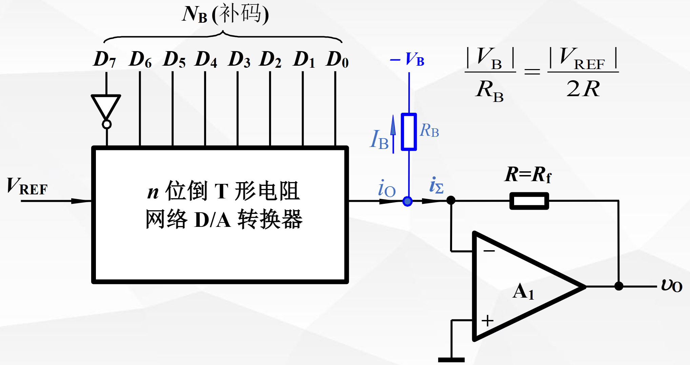

## chapter 10 数模/模数转换器

### 数模转换器

理论依据：任何一个二进制数$D_{n-1}D_{n-2}\cdots D_1D_0$都可以展开为

$$
N_B = D_{n-1}*2^{n-1}+\cdots +D_1*2^1  +D_0*2^0
$$

#### 权电阻网络$D/A$转换器

##### 电路特点

##### 缺点

- 电阻相差太大，位数过多时，难以获得精确的对应电阻

### 倒T型电阻网络DA转换器

##### 电路结构

##### 相关计算

$$
I = \frac{V_{REF}}{R}
$$

- 流入每个2R的电流从高位到低位按2的整数倍递减

$$
i_{\Sigma} = \frac{V_{REF}}{R}(\frac{D_0}{2^4}+\frac{D_1}{2^3}+\frac{D_2}{2^2}+\frac{D_3}{2^1})
$$

- 运放输出的模拟电压

$$
V_0 = -i_{\Sigma}R_f =  -\frac{R_f}{R}*\frac{V_{REF}}{2^4}\sum(D_i*2^i)
$$

#### 权电流$D/A$转换器

#### $D/A$转换器的输出方式

##### 思想

**用单极性$D/A$转换器转换补码的思路**

- DAC将偏移码当成自然二进制数处理
- 从输出中应该扣除偏移值转换后对应的模拟量

##### 电路

#### $D/A$转换器的主要技术指标

##### 分辨率

- 最小输出电压$V_{LSB}$：指输入数码仅$D_0$为1，其余各位均为0时，所对应的输出电压值
- 最大输出电压$V_{max}$：是指输入数码全部为1时，所对应的输出电压值，有时称为  **满刻度输出电压$V_{FSR}$**
- 分辨率：用来表征$D/A$转换器对输入量微小变化的敏感程度
  - 分辨率只与位数有关，与基准电压$V_{REF}$的大小无关
  - 位数越多，分辨率越高

$$
分辨率 = \frac{V_{LSB}}{V_{max}} = \frac{1}{2^n - 1}
$$

#####  转换精度

是指在稳态工作时，实际输出的模拟量与理想值之间存在的最大偏差

包括

- 比例系数误差

  指实际转换特性曲线的斜率与理想特性曲线斜率的偏差

  引起误差的原因：

  - 基准电压偏离标准值
  - 运放闭环增益偏离设计值

- 失调误差

  是指输入数字量全为0时，模拟量的实际起始数值不为零值

  引起误差的原因：

  - 运算放大器的零点漂移

- 非线性误差

  是指表征转换器输入的数字量作等量增加时，其输出的模拟电压不能等量增加的程度

  引起误差的原因

  - 开关导通的等效电阻不为零
  - 电阻网络中阻值的偏差

##### 转换速度

- 建立时间

  输入数字量变化时，输出电压达到规定误差范围所需的时间

- 转换速率

  指大信号工作状态下， 模拟输出电压的最大变化率通常 $V/us$e为单位

### 模数转换器

##### 一般过程

能将模拟量（电压或者电流）成正比地转换成对应的数字量。

$A/D$转换器一般包括 **取样、保持、量化及编码**过程

- 取样定理

- 量化：

  把取样得到的数值表示为某个最小数量单位的整数倍/

  量化所取的最小数量单位成为 **量化单位** 用 $\Delta $ 表示

   取样值是连续的可能无法将$\Delta$整除，所以量化前后存在一定误差，称为 **量化误差.**

  量化方式

  - 舍尾取整

    量化中将不足一个量化单位的部分舍弃，对于等于或大于一个量化单位的部分按照一个量化单位处理

  - 四舍五入

    量化过程中，将不足半个量化单位部分舍弃，对于等于或大于半个量化单位的按照一个量化单位处理，最大量化误差自然不超过$\frac{\Delta}{2}$

  

- 编码

  - 将量化后的结果用二进制码表示出来
  - 经编码输出的代码就是$A/D$转换器的结果

####   并行比较性AD电路

#####   电路

- 取量化单位 $\Delta= 1LSB = 2/15V$ 则最大量化误差$|\varepsilon_{max} | = \frac{1}{2} LSB = 1*15V$ 

#####    特点

- 缺点
  - 电路复杂
- 优点：
  - 转换速度快

#### 逐次比较型AD转换器

##### 电路

##### 特点

- 完成一次转换所需时间同其位数和时钟脉冲频率有关
- 位数越多，精度越高

#### 双积分式AD转换器

##### 电路

##### 具体分析

##### 特点

- 优点
  - 转换结果与RC无关，消除了积分非线性带来的误差
  - 只要求时钟源在一个转换周期内保持稳定
  - 有很强的抗工频干扰的能力
- 缺点
  - 工作速度较低，转换速度在每秒几十次以内
  - 通常用于对速度要求不高、精度要求较高的测量仪表、工业测控系统中

#### AD转换器主要的技术指标

##### 转换精度

集成AD转换器转换精度用 **分辨率**和 **转换误差**描述

- 分辨率：说明AD转换器对输入信号的分辨能力
- 转换误差：表示AD转换器实际输出的数字量和理论上的输出数字量之间的误差

##### 转换时间

指AD转换器从转换控制信号到来开始，到输出端得到稳定的数字信号所经过的时间

| 电路类型                | 转换速度      | 比较 |
| ----------------------- | ------------- | ---- |
| 并行比较AD转换器（8位） | <50ns         | 最高 |
| 逐次比较AD转换器        | 10-50us       | 居中 |
| 间接AD转换器            | 10ms ~ 1000ms | 最慢 |