# Chapter 2 逻辑代数

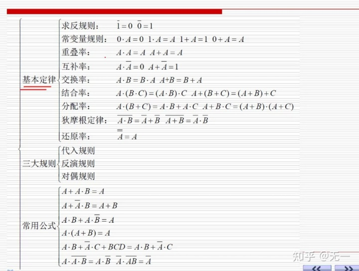

## 一些常用公式和定律

**基本定律**

- 0,1律
- 互补律
- 重叠律
- 交换律
- 结合律
- 分配律
- 反演律（摩根定律)
- 吸收律

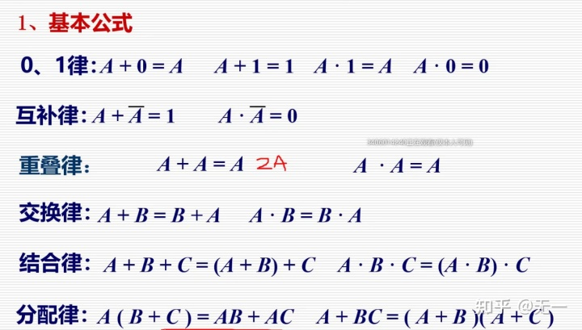

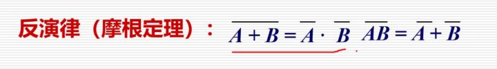

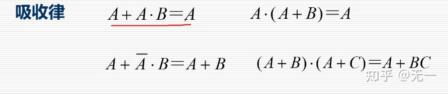

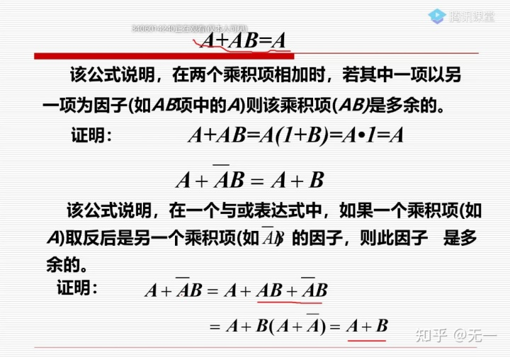

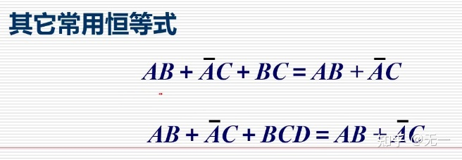

## 逻辑代数的基本规则

- 代入规则：在任何一个逻辑等式中，如果用一个函数代替等式两边出现的某变量A，则等式依然成立
- 反演规则：求*非函数*时：**与或互换，原变量换为非变量，并将1与0互换，所得的就是非函数。**（保持原来的运算顺序，先与后或，可以用括号；非变量以外的非不变）

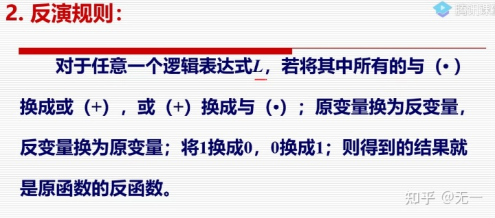

- 对偶规则：求*对偶式*时，**与或互换，0，1互换**（保持顺序与反演一样）。

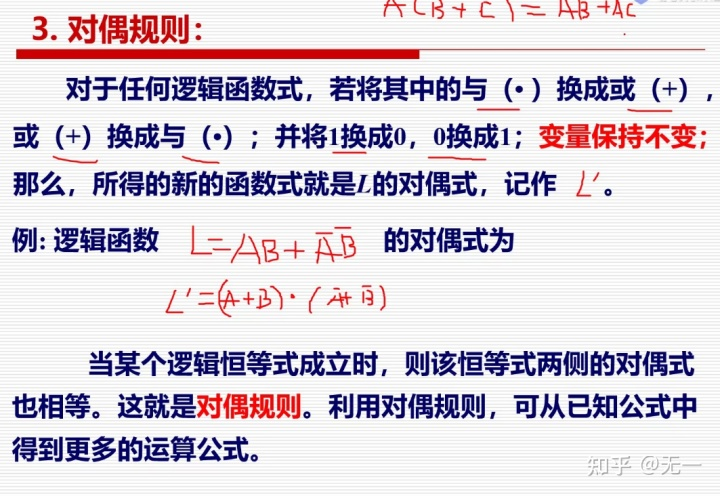

## 逻辑函数表达形式

- 与或：若干与项进行或逻辑

$$
L = A * C + \bar{C} *D
$$

- 或与：若干或项进行与逻辑

$$
L = ( A  + C ) * ( B + \bar{C}) * D
$$

### 最小项

最小项：一个乘积项包含了全部的变量（每个变量及其非都只出现一次）.最小项中0为非，1为原。

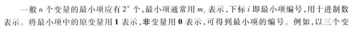

- 性质：每一组最小项，都只有一组取值为1，其余全为0（全部最小项积为0，和为1）

- 最小项表达式（标准与或表达式）：**最小项进行或逻辑运算**

   
### 最大项

  最大项：一个或项包含了全部的变量（每个变量及其非都只出现一次），最大项中0为原，1为非。

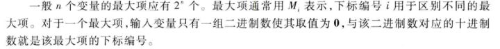

- 性质：任意一个最大项，只有一组取值为0.所有最大项和为1，积为0
- 最大项表达式（标准或与表达式）：**最大项的乘积**。
- 下标相同的最大项和最小项互补。

## 逻辑函数的形式

与或，与非-与非，或与，或非-或非，与或非

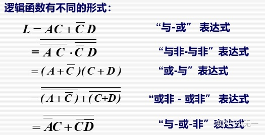

## 逻辑函数的化简

- 化简的原因：实现函数只需要一种规格的逻辑门，给电路设计带来方便
- 在若干逻辑关系相同的与或表达式中，将其中包含的与项数最少，且每个与项中变量数最少的表达式称为是最简与或表达式

### 逻辑函数的代数化简方法：

- 并项法:

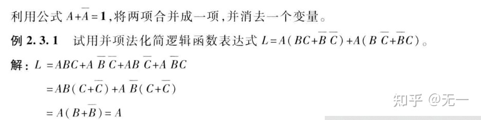

- 吸收法：

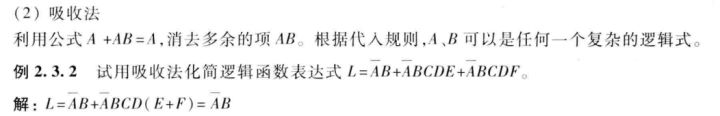

- 消去法：

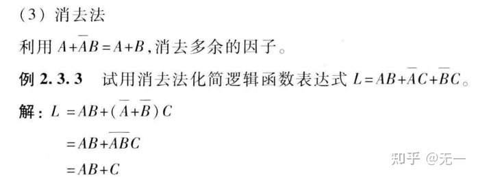

### 德摩根定律化简（A非或B非）

- 配项法

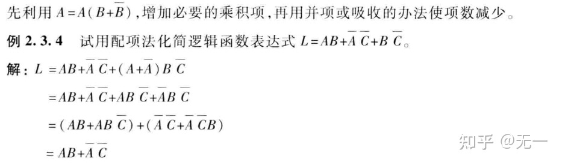

### 逻辑函数形式的变换

通常化简为与或表达式再转换形式。

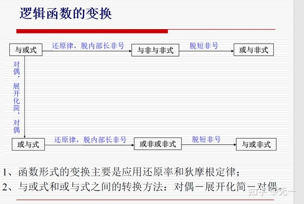

### 卡诺图化简方法

- 卡诺图定义：此函数的最小项表达式中的各最小项相应的填入一个特定的方格内，此方格为卡诺图（一般用于3，4个变量的逻辑函数化简，原因是卡诺图的个数为2的n次方，太多不方便）(最简式为与或形式的为最小项，为或与形式的为最大项)
- 卡诺图的特点：几何位置相邻的最小项在逻辑上也是相邻的（只有一位变量不同，类似格雷码，画图的时候可以根据格雷码最小位镜像对称的特点标号，具有上下左右封闭性（即最左边和最右边，最上边和最下边，四个角都是相邻的）
- 卡诺图画法：当逻辑函数为最小项表达式时，在卡诺图对应最小项的方格中填入1，其余方格用0或者空格表达。

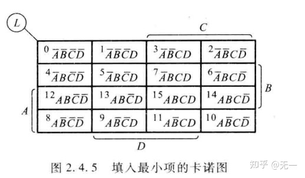

- 化简依据：代数化简验证（化简时，不变的变量留下，变得变量去除）
- 化简方法（一次只能圈2的次方个，可以两次圈同一个，但必须要有新的）：

1. 写出最小项表达式
2. 画出卡诺图
3. 将无相邻的项单独圈出来
4. 将只有一种圈法的圈起来
5. 将剩余的圈出来（尽可能的圈大，圈出来的数多）

- 无关项:取值无法取到的项为无关项，例如用8421BCD码表示0—9，则剩下的就为无关项。
- 化简：无关项可以取0或者1，视情况定，原则上是怎样化简简单怎么取

