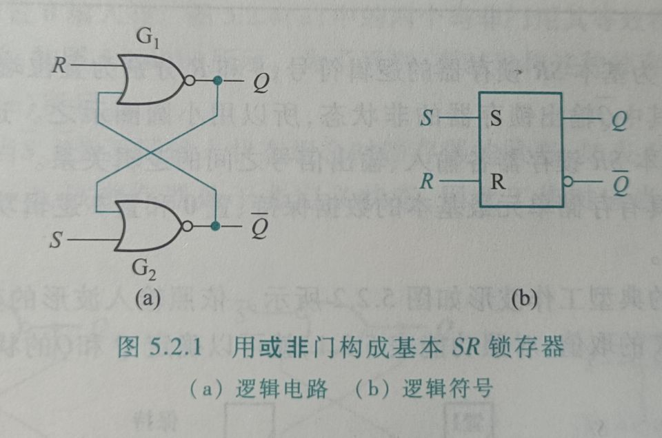
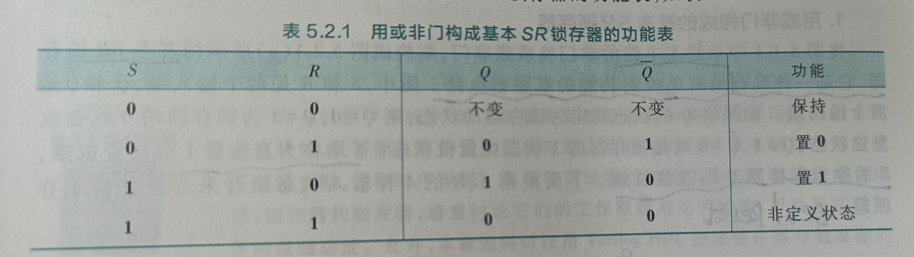
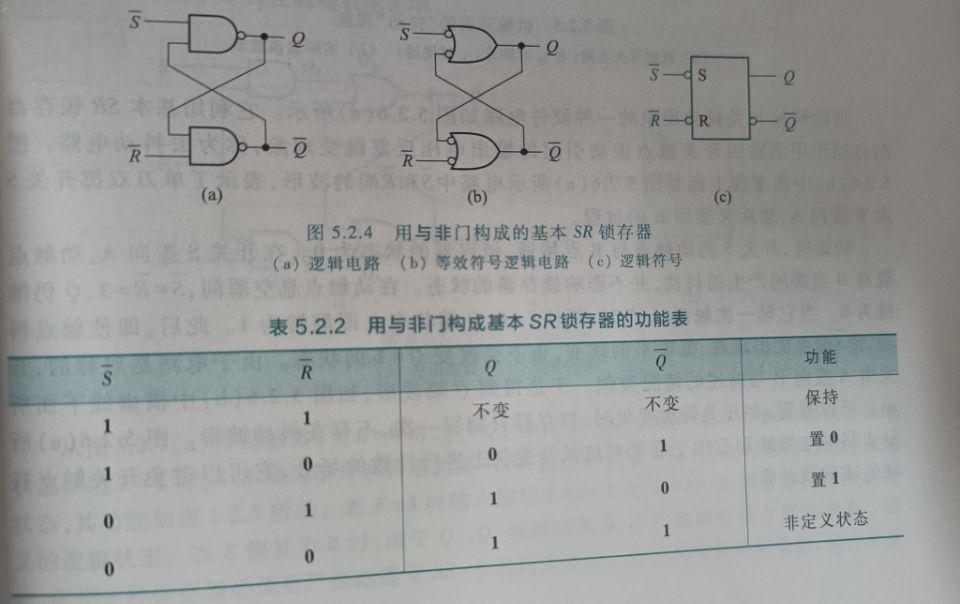
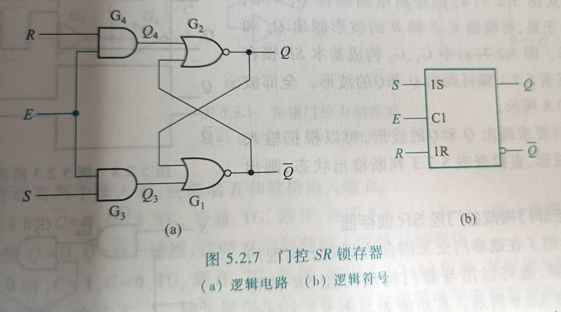
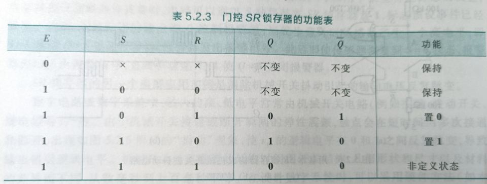
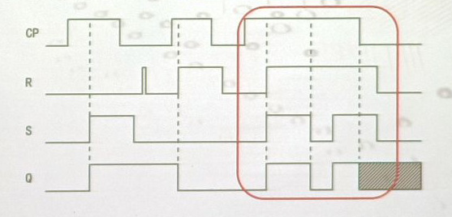
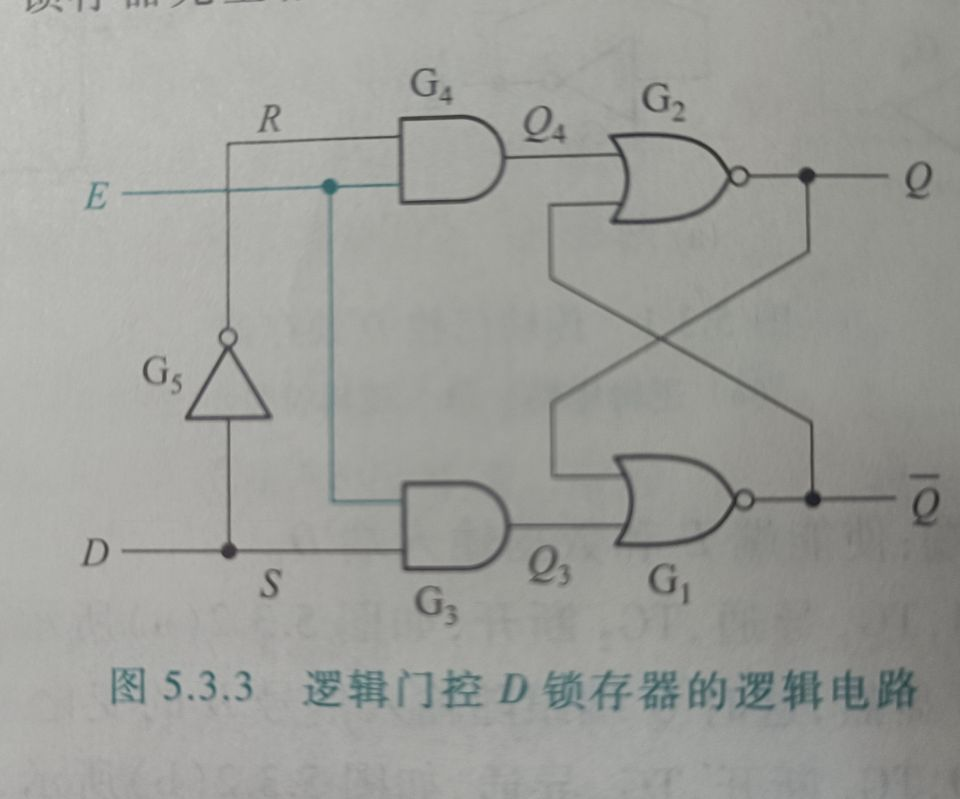
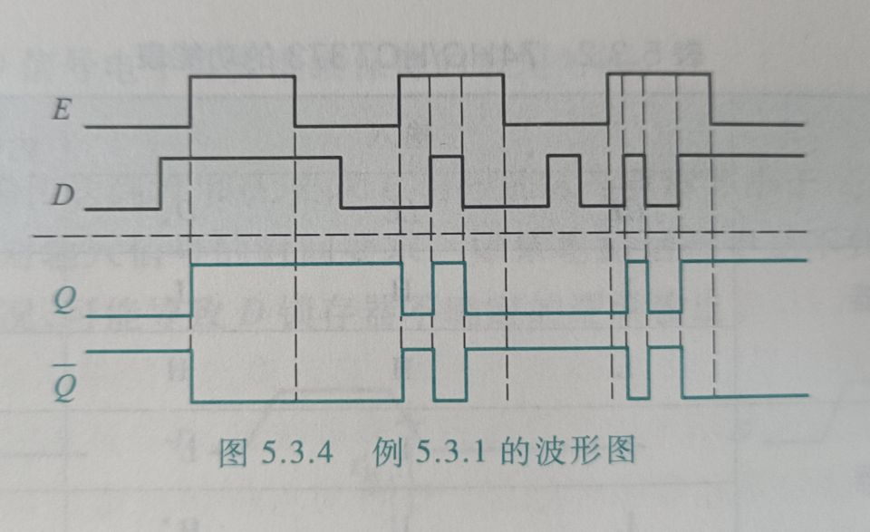
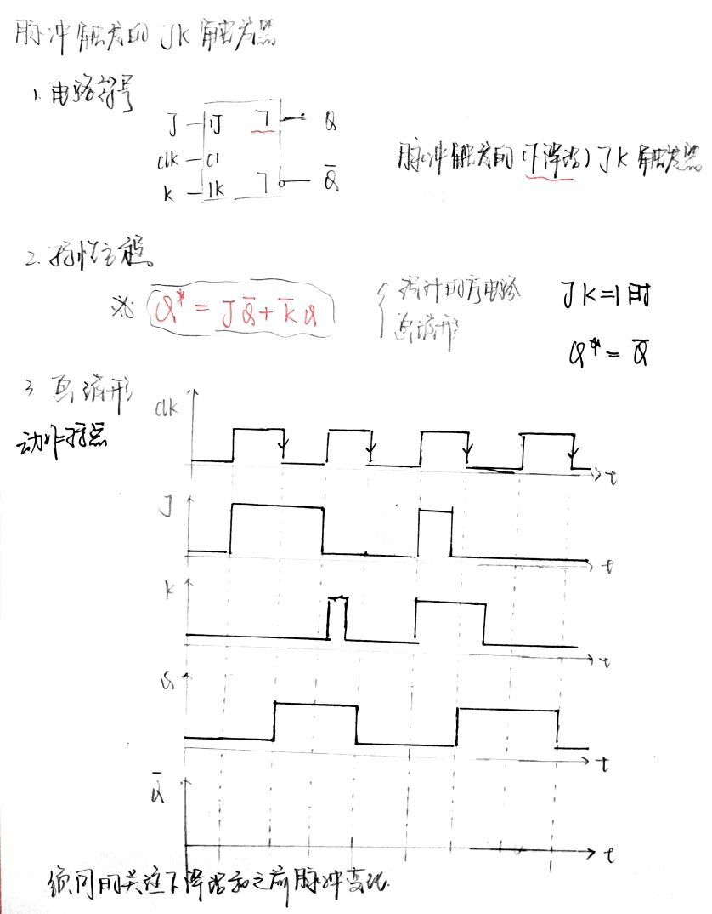

# Chapter 5 锁存器和触发器

## 基本稳态电路

将Q设置成电路的状态，Q = 0 表示电路为 0 状态，  Q = 1 表示电路为 1 状态。

一旦进入其中一种状态。就能长期保持不变的单元电路，称为**双稳态存储电路**，简称为**双稳态电路**

## SR锁存电路

S端称为直接 置 1 端 或置位端， R端称为直接置零端或复位端 (set/Reset)

### 基本SR锁存器

#### 用或非门实现

基本SR锁存器具有存储单元最基本的数据保持，置一和置零的逻辑功能，实际应用中可以作为存储单元

并且在波形图中，不确定性的地方用阴影表示，在实际应用中应该避免出现这样的情况。

#### 用与非门构成的基本SR锁存器

### 门控SR锁存器的逻辑功能

在基本SR锁存器输入端增加一堆与门和一个控制端，构成了门控SR锁存器，其中E为控制端或使能端

其基本功能表如下图所示

效果：

- 通过门控电路抑制干扰
- 建立了存储器件 $Q^n$ 到$Q^{n+1}$的体系
  - 期望一次时钟端有效期间只发生依次输出状态的改变

## D锁存器

##  JK触发器

#### 方法总结

- 列出目标触发器的激励表
- 列出源触发器的激励表
- 求出目标激励条件到原触发器输入的转换方程
- 做出逻辑电路图

