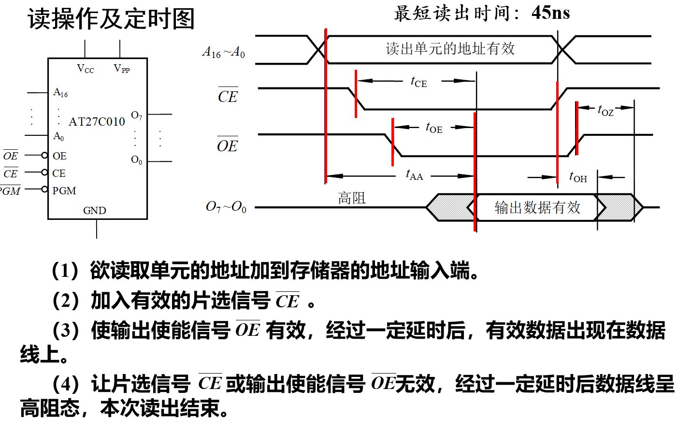

## Chapter 7 半导体存储器

### 分类

- 按照数据易失性和非易失性分成两大类：

  - ROM（非易失）断电后存储的数据仍可长期保存

    - 固定ROM	
    - 可编程ROM
      - PROM	
      - EPROM
      - $E^2PROM$ 
      - Flash Memory(闪存)

  - RAM（易失）断电后存储的数据将消失

    - 双极性RAM

    - MOS型

      - 静态RAM（SRAM） 
        - 异步SRAM（ASRAM）
        - 同步SRAM（SSRAM）

      - 动态RAM（DRAM）
        - 异步RAM（ADRAM）
        - 同步RAM（SDRAM）

- 按照正常工作读写特性来分类

  - 只读
    - ROM
    - PROM
    - EPROM
  - 可读可写
    - RAM
    - $E^2PROM$
    - Flash Memory 

### 只读存储器（ROM）

#### 结构

- 字长：字中所含的位数

- 地址单元：构成同一个字的存储单元

- 存储阵列中有N个地址单元，地质单元数与地址码关系：
  $$
  N = 2^n
  $$
  地址单元数<==>字数

- 存储容量：存储二值信息的总量；存储容量 = 字数 * 位数

#### 工作原理

#### 可编程ROM

##### PROM

-  一次编写完成，不可修改

##### EPROM

- 光可擦除可编程ROM，可多次编程，但是必须使用紫外线进行擦除数据

##### EEPROM / $E^2PROM$ 

- 电擦除可编程ROM，可进行“在线”进行擦除和编程

  编程单元——浮栅隧道氧化层MOS管(Floating-gate Tuned Oxide，Flotox管

**读操作**

**写操作**

##### flash Memory

- 快存存储器，更高的密度和更快的读写速度

  编程单元——快闪(Flash)叠栅MOS管。

**写入数据**

**读取数据**

#### 读操作举例

### 随机存储器（RAM）

- SRAM：static Random-Access Memory。存储单元类似锁存器，有0、1两个稳态
- DRAM：Dynamic Random-Access Memory。用电容器存储电荷来保存0、1，需要定时刷新

#### 结构和工作原理

#### 存储容量扩展

##### 字长（位数）的扩展

通过芯片的并联实现位扩展，即将RAM的地址线、读/写控制线和片选信号对应地并接在一起，而各芯片的数据线作为字的各个位线。

##### 字数的扩展

需要增加地址码的位数，将所有芯片的地址线各自对应并接在一起，作为低位地址码的输入端，剩余的高位地址码，经外加的译码器译码后，分别控制各个芯片的片选，所有芯片的读写控制线和数据线也都分别并接在一起。 

