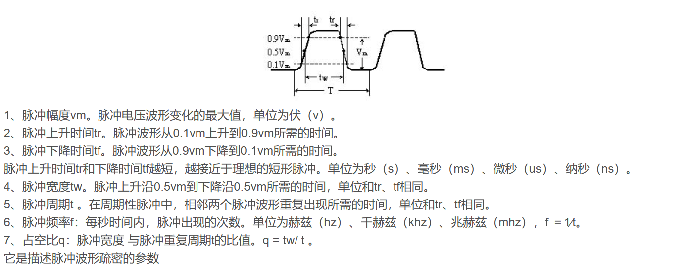
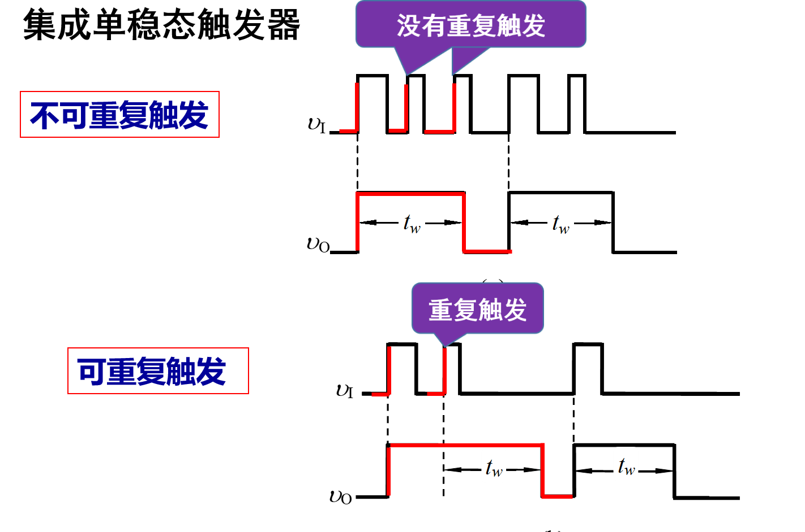
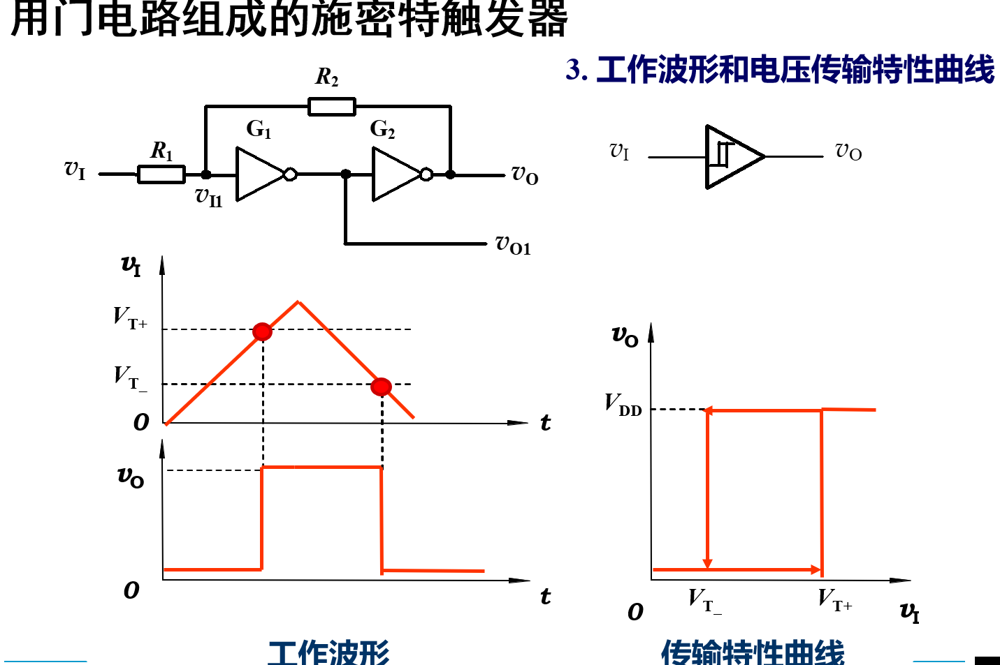
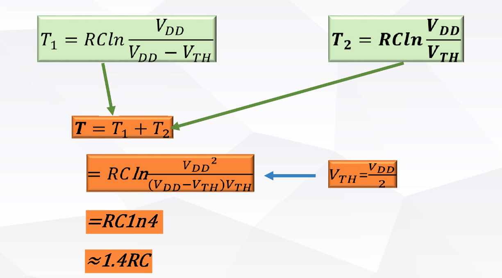

## Chapter 9 脉冲波形的变换和产生

### 脉冲信号参数

### 单稳态电路

- 可重复触发与不可重复触发应用

- 相关公式

$$
t_w = R_1C_1
$$

### 施密特触发器

- 电路中参数的确定

### 多谐振荡器

主要包括开关电路和延时电路组成

- 开关电路
  - 逻辑门
  - 比较器
  - 计时器
- 延时电路
  - RC延时
  - 门传输延迟

**震荡周期计算**

